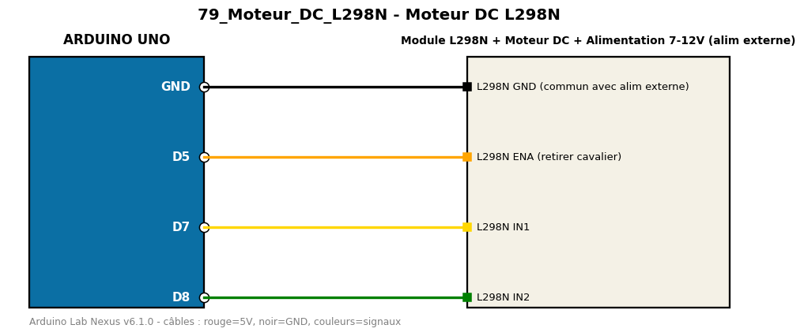

# Moteur DC L298N

Fait tourner un moteur DC dans les deux sens avec variation de vitesse via un L298N.

**Composants :** Module L298N, Moteur DC, Alimentation 7-12V (alim externe)

**Bibliothèques :** aucune

| Arduino | Composant | Couleur fil |
|---|---|---|
| GND | L298N GND (commun avec alim externe) | black |
| D5 | L298N ENA (retirer cavalier) | orange |
| D7 | L298N IN1 | gold |
| D8 | L298N IN2 | green |

Moniteur série : 9600 bauds. Toujours câbler **carte débranchée**.
