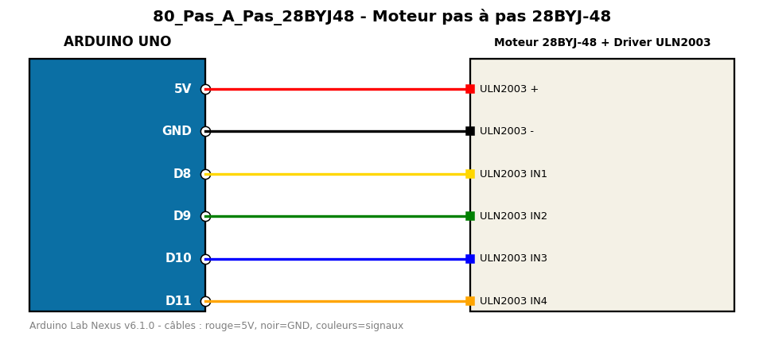

# Moteur pas à pas 28BYJ-48

Fait un tour complet dans chaque sens avec un 28BYJ-48 et son driver ULN2003.

**Composants :** Moteur 28BYJ-48, Driver ULN2003

**Bibliothèques :** Stepper

| Arduino | Composant | Couleur fil |
|---|---|---|
| 5V | ULN2003 + | red |
| GND | ULN2003 - | black |
| D8 | ULN2003 IN1 | gold |
| D9 | ULN2003 IN2 | green |
| D10 | ULN2003 IN3 | blue |
| D11 | ULN2003 IN4 | orange |

Moniteur série : 9600 bauds. Toujours câbler **carte débranchée**.
