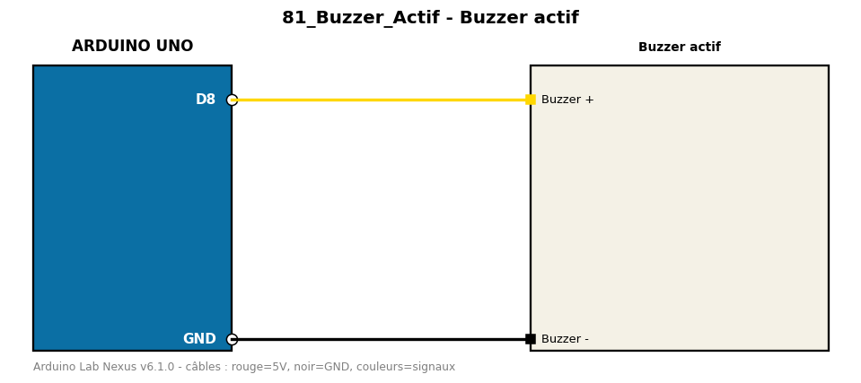

# Buzzer actif

Émet des bips réguliers avec un buzzer actif (simple marche/arrêt).

**Composants :** Buzzer actif

**Bibliothèques :** aucune

| Arduino | Composant | Couleur fil |
|---|---|---|
| D8 | Buzzer + | gold |
| GND | Buzzer - | black |

Moniteur série : 9600 bauds. Toujours câbler **carte débranchée**.
