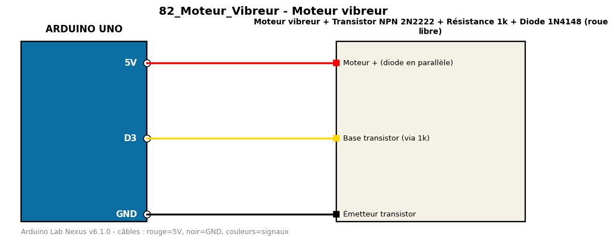

# Moteur vibreur

Commande un moteur vibreur via un transistor NPN, avec intensité variable en PWM.

**Composants :** Moteur vibreur, Transistor NPN 2N2222, Résistance 1k, Diode 1N4148 (roue libre)

**Bibliothèques :** aucune

| Arduino | Composant | Couleur fil |
|---|---|---|
| 5V | Moteur + (diode en parallèle) | red |
| D3 | Base transistor (via 1k) | gold |
| GND | Émetteur transistor | black |

Moniteur série : 9600 bauds. Toujours câbler **carte débranchée**.
