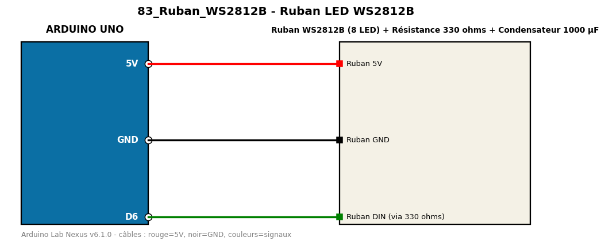

# Ruban LED WS2812B

Anime un ruban de 8 LED adressables NeoPixel (chenillard puis arc-en-ciel).

**Composants :** Ruban WS2812B (8 LED), Résistance 330 ohms, Condensateur 1000 µF

**Bibliothèques :** Adafruit NeoPixel

| Arduino | Composant | Couleur fil |
|---|---|---|
| 5V | Ruban 5V | red |
| GND | Ruban GND | black |
| D6 | Ruban DIN (via 330 ohms) | green |

Moniteur série : 9600 bauds. Toujours câbler **carte débranchée**.
