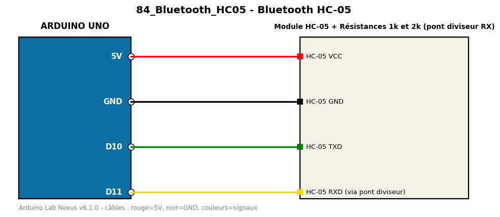

# Bluetooth HC-05

Pont série entre le moniteur série et un smartphone via le module Bluetooth HC-05.

**Composants :** Module HC-05, Résistances 1k et 2k (pont diviseur RX)

**Bibliothèques :** aucune

| Arduino | Composant | Couleur fil |
|---|---|---|
| 5V | HC-05 VCC | red |
| GND | HC-05 GND | black |
| D10 | HC-05 TXD | green |
| D11 | HC-05 RXD (via pont diviseur) | gold |

Moniteur série : 9600 bauds. Toujours câbler **carte débranchée**.
