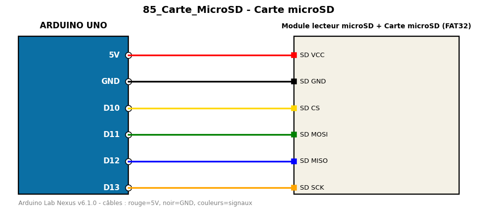

# Carte microSD

Écrit une ligne dans un fichier sur carte microSD puis relit le fichier.

**Composants :** Module lecteur microSD, Carte microSD (FAT32)

**Bibliothèques :** SD

| Arduino | Composant | Couleur fil |
|---|---|---|
| 5V | SD VCC | red |
| GND | SD GND | black |
| D10 | SD CS | gold |
| D11 | SD MOSI | green |
| D12 | SD MISO | blue |
| D13 | SD SCK | orange |

Moniteur série : 9600 bauds. Toujours câbler **carte débranchée**.
