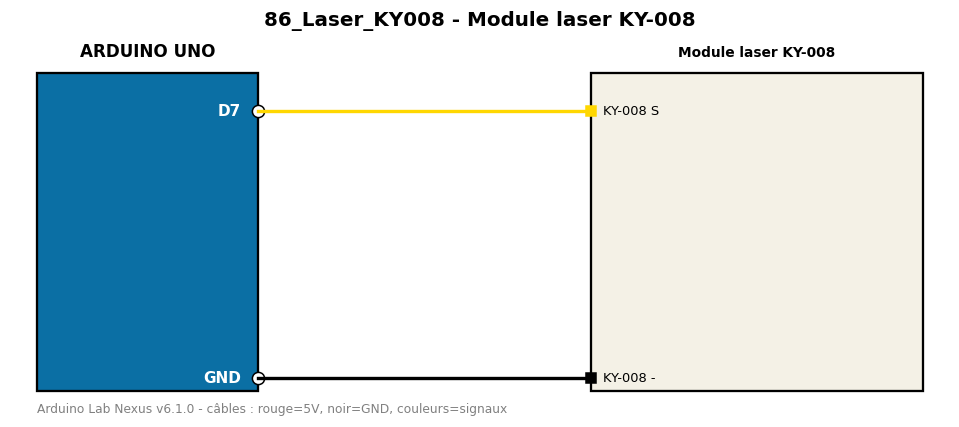

# Module laser KY-008

Fait clignoter le module laser KY-008 (ne jamais viser les yeux).

**Composants :** Module laser KY-008

**Bibliothèques :** aucune

| Arduino | Composant | Couleur fil |
|---|---|---|
| D7 | KY-008 S | gold |
| GND | KY-008 - | black |

Moniteur série : 9600 bauds. Toujours câbler **carte débranchée**.
