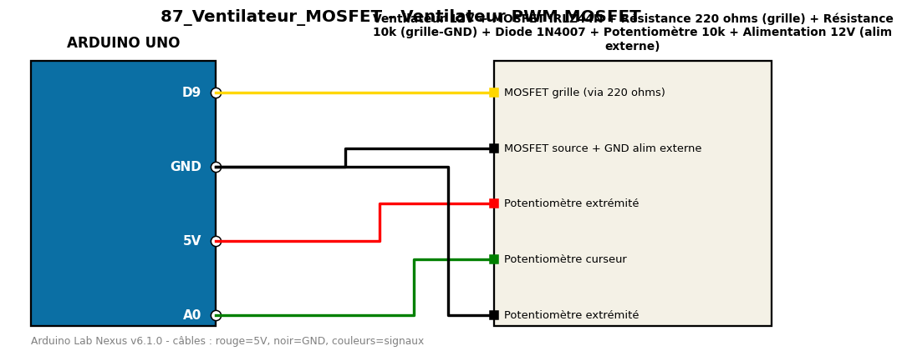

# Ventilateur PWM MOSFET

Règle la vitesse d'un ventilateur 12V avec un potentiomètre via un MOSFET logique.

**Composants :** Ventilateur 12V, MOSFET IRLZ44N, Résistance 220 ohms (grille), Résistance 10k (grille-GND), Diode 1N4007, Potentiomètre 10k, Alimentation 12V (alim externe)

**Bibliothèques :** aucune

| Arduino | Composant | Couleur fil |
|---|---|---|
| D9 | MOSFET grille (via 220 ohms) | gold |
| GND | MOSFET source + GND alim externe | black |
| 5V | Potentiomètre extrémité | red |
| A0 | Potentiomètre curseur | green |
| GND | Potentiomètre extrémité | black |

Moniteur série : 9600 bauds. Toujours câbler **carte débranchée**.
