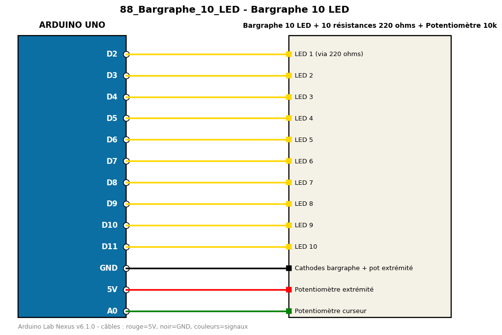

# Bargraphe 10 LED

Affiche la position d'un potentiomètre sur un bargraphe de 10 LED.

**Composants :** Bargraphe 10 LED, 10 résistances 220 ohms, Potentiomètre 10k

**Bibliothèques :** aucune

| Arduino | Composant | Couleur fil |
|---|---|---|
| D2 | LED 1 (via 220 ohms) | gold |
| D3 | LED 2 | gold |
| D4 | LED 3 | gold |
| D5 | LED 4 | gold |
| D6 | LED 5 | gold |
| D7 | LED 6 | gold |
| D8 | LED 7 | gold |
| D9 | LED 8 | gold |
| D10 | LED 9 | gold |
| D11 | LED 10 | gold |
| GND | Cathodes bargraphe + pot extrémité | black |
| 5V | Potentiomètre extrémité | red |
| A0 | Potentiomètre curseur | green |

Moniteur série : 9600 bauds. Toujours câbler **carte débranchée**.
