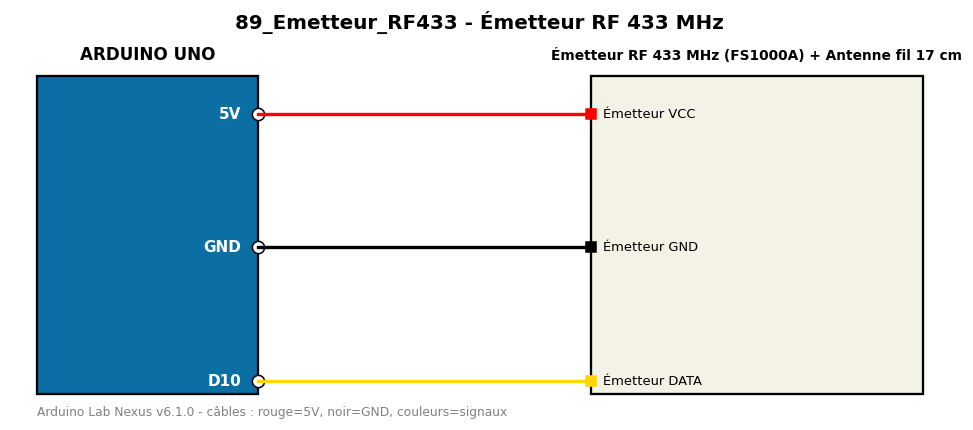

# Émetteur RF 433 MHz

Envoie un code numérique toutes les secondes avec un émetteur 433 MHz.

**Composants :** Émetteur RF 433 MHz (FS1000A), Antenne fil 17 cm

**Bibliothèques :** rc-switch

| Arduino | Composant | Couleur fil |
|---|---|---|
| 5V | Émetteur VCC | red |
| GND | Émetteur GND | black |
| D10 | Émetteur DATA | gold |

Moniteur série : 9600 bauds. Toujours câbler **carte débranchée**.
