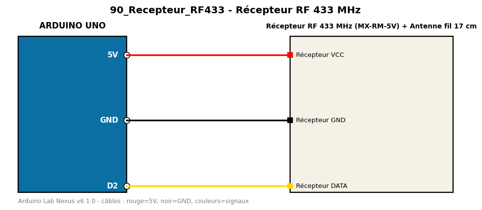

# Récepteur RF 433 MHz

Reçoit et affiche les codes 433 MHz (télécommandes ou sketch émetteur).

**Composants :** Récepteur RF 433 MHz (MX-RM-5V), Antenne fil 17 cm

**Bibliothèques :** rc-switch

| Arduino | Composant | Couleur fil |
|---|---|---|
| 5V | Récepteur VCC | red |
| GND | Récepteur GND | black |
| D2 | Récepteur DATA | gold |

Moniteur série : 9600 bauds. Toujours câbler **carte débranchée**.
