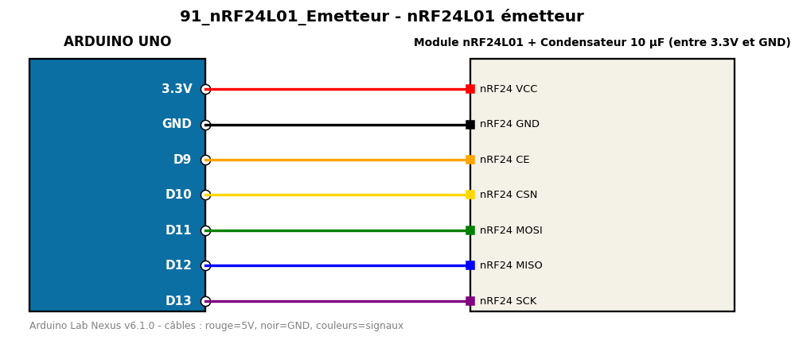

# nRF24L01 émetteur

Envoie un compteur sans fil à 2,4 GHz avec un module nRF24L01.

**Composants :** Module nRF24L01, Condensateur 10 µF (entre 3.3V et GND)

**Bibliothèques :** RF24

| Arduino | Composant | Couleur fil |
|---|---|---|
| 3.3V | nRF24 VCC | red |
| GND | nRF24 GND | black |
| D9 | nRF24 CE | orange |
| D10 | nRF24 CSN | gold |
| D11 | nRF24 MOSI | green |
| D12 | nRF24 MISO | blue |
| D13 | nRF24 SCK | purple |

Moniteur série : 9600 bauds. Toujours câbler **carte débranchée**.
