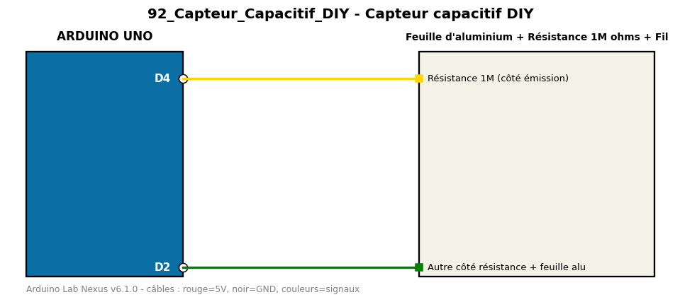

# Capteur capacitif DIY

Détecte le toucher d'une feuille d'aluminium et allume la LED intégrée.

**Composants :** Feuille d'aluminium, Résistance 1M ohms, Fil

**Bibliothèques :** CapacitiveSensor

| Arduino | Composant | Couleur fil |
|---|---|---|
| D4 | Résistance 1M (côté émission) | gold |
| D2 | Autre côté résistance + feuille alu | green |

Moniteur série : 9600 bauds. Toujours câbler **carte débranchée**.
