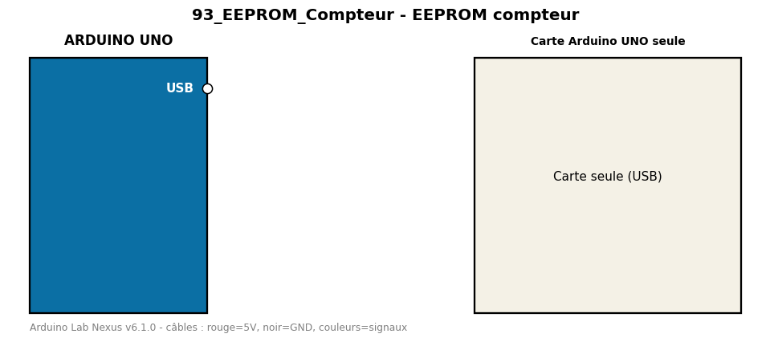

# EEPROM compteur

Compte le nombre de démarrages de la carte et le mémorise en EEPROM interne.

**Composants :** Carte Arduino UNO seule

**Bibliothèques :** aucune

| Arduino | Composant | Couleur fil |
|---|---|---|

Moniteur série : 9600 bauds. Toujours câbler **carte débranchée**.
