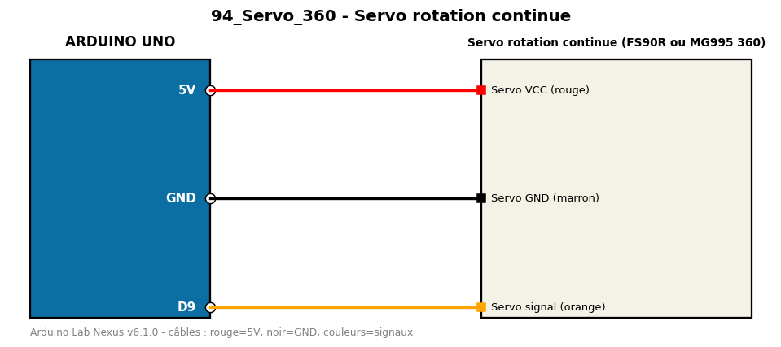

# Servo rotation continue

Commande la vitesse et le sens d'un servo à rotation continue 360°.

**Composants :** Servo rotation continue (FS90R ou MG995 360)

**Bibliothèques :** Servo

| Arduino | Composant | Couleur fil |
|---|---|---|
| 5V | Servo VCC (rouge) | red |
| GND | Servo GND (marron) | black |
| D9 | Servo signal (orange) | orange |

Moniteur série : 9600 bauds. Toujours câbler **carte débranchée**.
