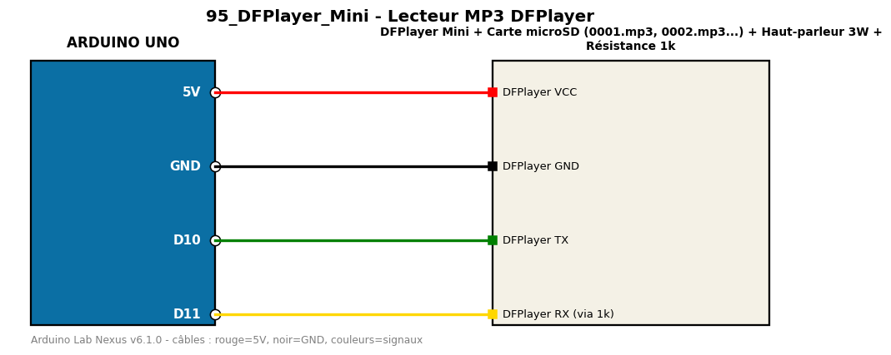

# Lecteur MP3 DFPlayer

Lit les fichiers MP3 d'une carte microSD avec le DFPlayer Mini.

**Composants :** DFPlayer Mini, Carte microSD (0001.mp3, 0002.mp3...), Haut-parleur 3W, Résistance 1k

**Bibliothèques :** DFRobotDFPlayerMini

| Arduino | Composant | Couleur fil |
|---|---|---|
| 5V | DFPlayer VCC | red |
| GND | DFPlayer GND | black |
| D10 | DFPlayer TX | green |
| D11 | DFPlayer RX (via 1k) | gold |

Moniteur série : 9600 bauds. Toujours câbler **carte débranchée**.
