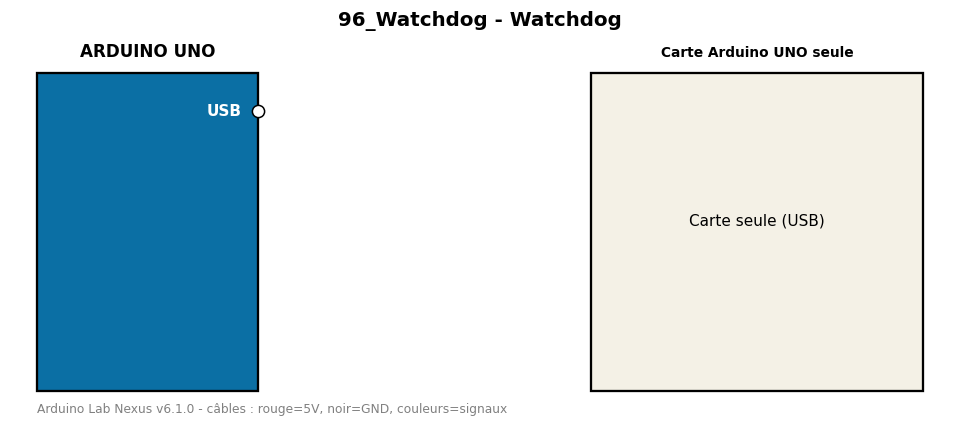

# Watchdog

Démontre le chien de garde : la carte redémarre seule si le programme se bloque.

**Composants :** Carte Arduino UNO seule

**Bibliothèques :** aucune

| Arduino | Composant | Couleur fil |
|---|---|---|

Moniteur série : 9600 bauds. Toujours câbler **carte débranchée**.
