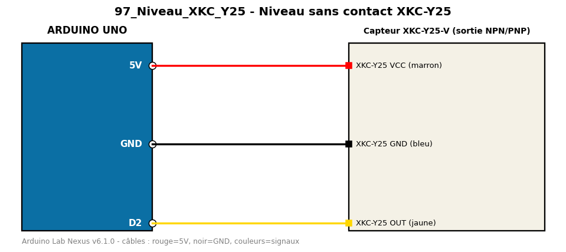

# Niveau sans contact XKC-Y25

Détecte la présence de liquide à travers la paroi d'un récipient.

**Composants :** Capteur XKC-Y25-V (sortie NPN/PNP)

**Bibliothèques :** aucune

| Arduino | Composant | Couleur fil |
|---|---|---|
| 5V | XKC-Y25 VCC (marron) | red |
| GND | XKC-Y25 GND (bleu) | black |
| D2 | XKC-Y25 OUT (jaune) | gold |

Moniteur série : 9600 bauds. Toujours câbler **carte débranchée**.
