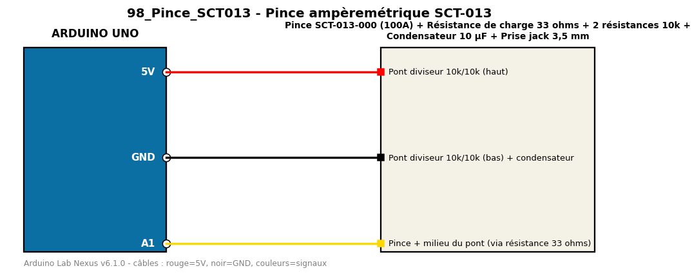

# Pince ampèremétrique SCT-013

Mesure le courant alternatif efficace avec une pince SCT-013 et EmonLib.

**Composants :** Pince SCT-013-000 (100A), Résistance de charge 33 ohms, 2 résistances 10k, Condensateur 10 µF, Prise jack 3,5 mm

**Bibliothèques :** EmonLib

| Arduino | Composant | Couleur fil |
|---|---|---|
| 5V | Pont diviseur 10k/10k (haut) | red |
| GND | Pont diviseur 10k/10k (bas) + condensateur | black |
| A1 | Pince + milieu du pont (via résistance 33 ohms) | gold |

Moniteur série : 9600 bauds. Toujours câbler **carte débranchée**.
