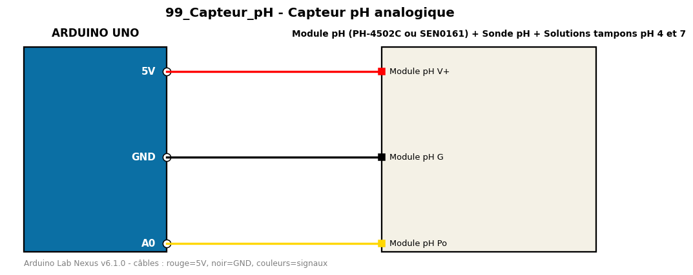

# Capteur pH analogique

Mesure le pH d'une solution avec une sonde et son module analogique.

**Composants :** Module pH (PH-4502C ou SEN0161), Sonde pH, Solutions tampons pH 4 et 7

**Bibliothèques :** aucune

| Arduino | Composant | Couleur fil |
|---|---|---|
| 5V | Module pH V+ | red |
| GND | Module pH G | black |
| A0 | Module pH Po | gold |

Moniteur série : 9600 bauds. Toujours câbler **carte débranchée**.
